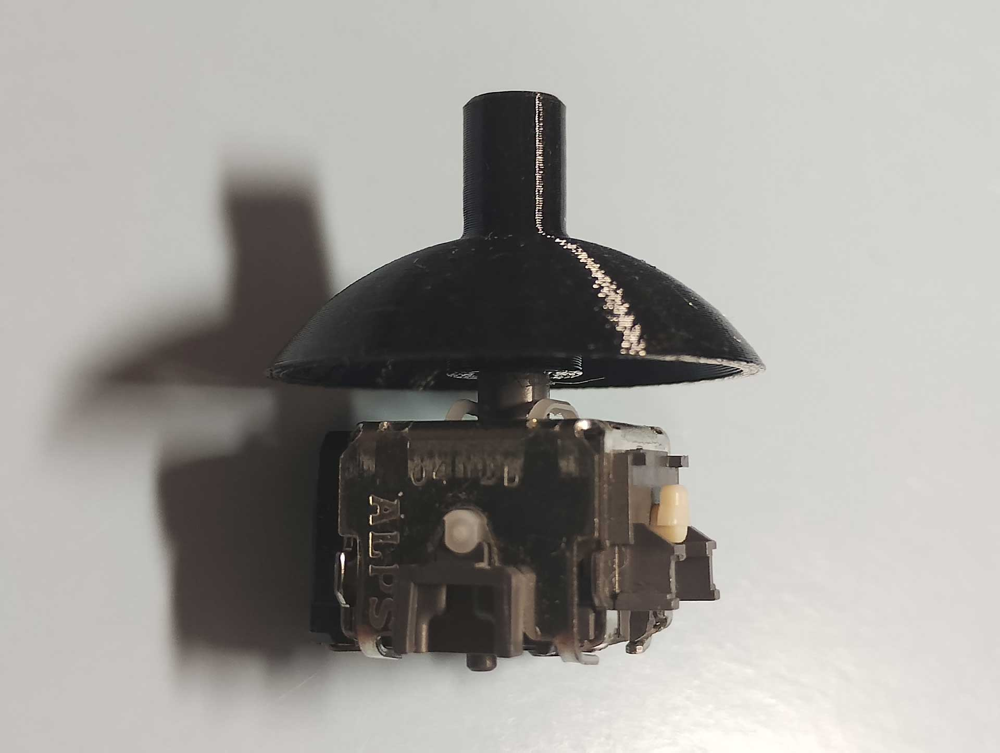

# G13 Joystick Repair kit 製作風景

 
 

## １．基板製作

  

オリジナルの基板をリバースエンジニアリングして、同等の回路で基板を製作しております。  

設計はKiCadで行い、GerberデータをJLCPCBに送って中国・深圳にて基板を製造します。  
 

これまでに外形、部品位置、フットプリントなど何度かリビジョンアップされておりますが、回路的には同一なので、以前のrevでも問題なく動作すると思います。

 
 
 
 

## ２．部品の実装

 
 

### コンデンサのハンダ付け

ミニホットプレートとペーストはんだでチップコンデンサをリフローはんだ付けします。  

小ロットの場合やリードタイプのコンデンサを使うときは手ハンダします。

 
 

### 脚のカット

キット取り付け時の干渉を防ぐためにマイクロスイッチ、ジョイスティックの脚の一部をカットしておきます。

 
 

### マイクロスイッチのハンダ付け

ジョイスティック下側のマイクロスイッチはボタン直押し構造にするためMOD位置にハンダ付けします。

 
 

ジョイスティック横のマイクロスイッチをハンダ付けします。

 
 

### ピンヘッダのハンダ付け

ピンヘッダをハンダ付けします。間隔が狭いのでルーペを使って慎重に作業します。  
ハンダ付けが適切であればハンダがピカッと光り富士山のような裾広がり形状になります。

 
 

### ジョイスティックのハンダ付け

ジョイスティックをハンダ付けします。こちらも間隔が狭い個所があるのでルーペを使って作業します。  

 
 

### 基板クリーニング

ハンダ付け個所がフラックスで汚れているのでフラックスクリーナーやIPAを使い洗浄します。  

 
 

### ハンダ付けチェック

ルーペ、実体顕微鏡などでハンダ付け不良がないか目視確認します。  

 
 

### 実機で確認

基板が再生産された場合やリビジョンアップ、使用部品を変更した際はG13に繋いで実機で動作確認します。  

 
 

## ３．３Dプリンター部品の作成

 
 

### ジョイスティックカバーの作成

ジョイスティックカバーは仕上がりや精度を高めるために１つずつ印刷します。  
PETG素材を使い、約25分かけて出力します。  

 
 

３Dプリンターの特性上、糸引きやバリが出る箇所があるので、細いタガネなどを使いカットします。  
特に軸穴は念入りに調整します。  

 
 

サムパッドカバーは、全数を実際にジョイスティックに取り付けて検査しております。  

 
 

サムパッドを印刷して、ジョイスティックカバーに圧入で取付けします。  

 
 

### スイッチ押し用ネジの作成

M2タッピングビスの先端が尖っているので、ペアンで掴み、ダイヤモンドホイールで平らに成形します。  

 
 

3Dプリンターで製作したスリーブをビスに取り付けます。  
