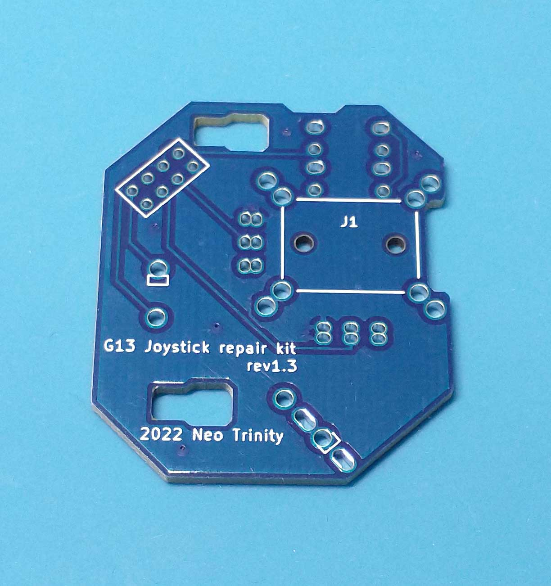
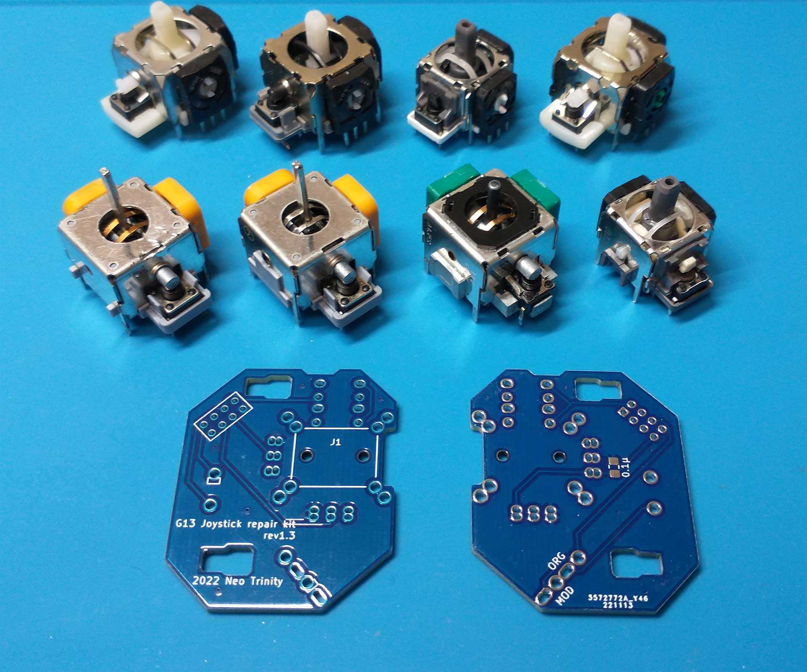
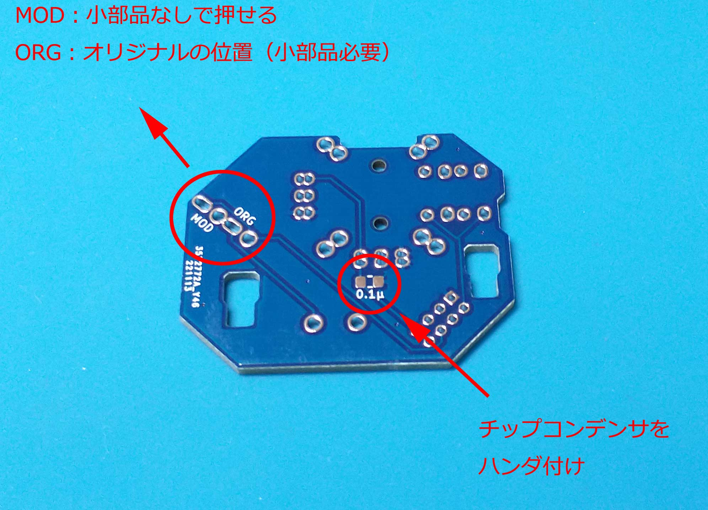
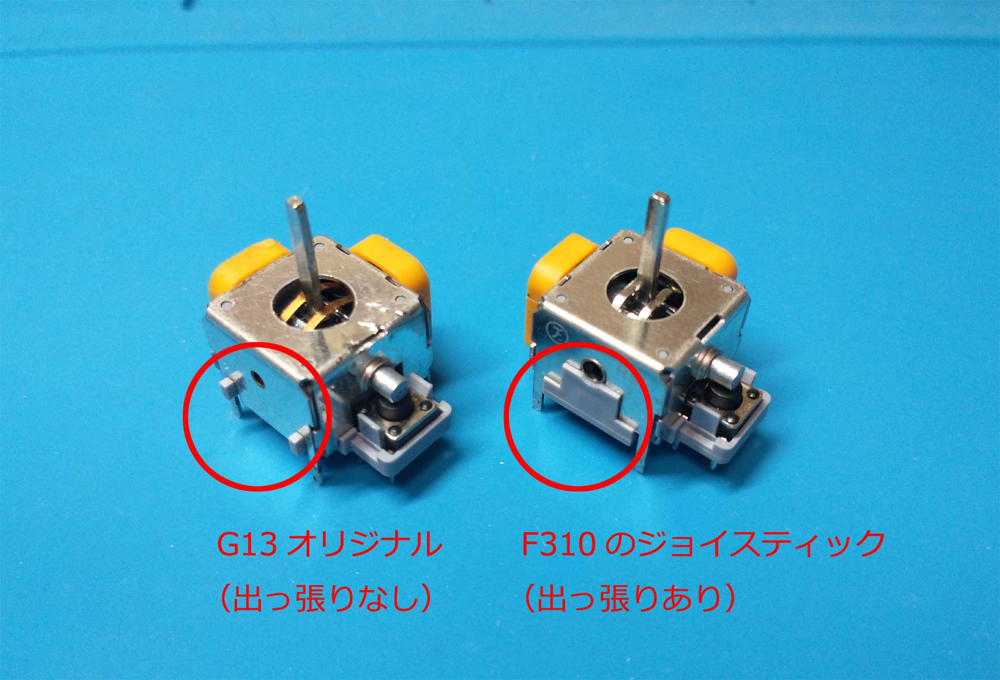
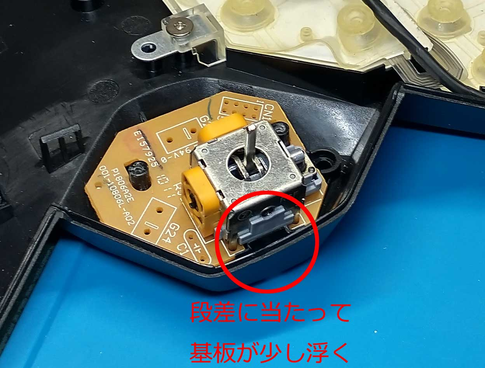
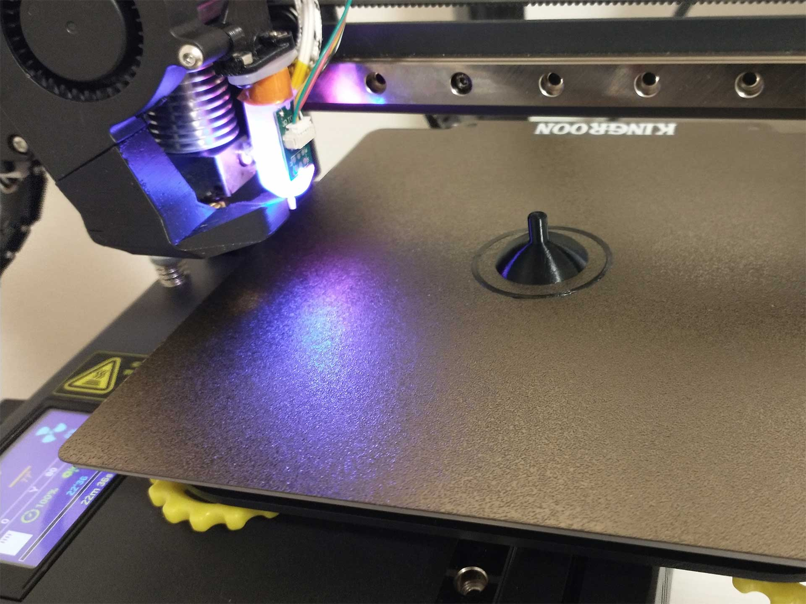

# G13 JoystickRepairkit 基板の覚え書き

  

 
 
 
 

### 使用できるアナログジョイスティック

  

オリジナルのジョイスティックはもちろんのこと、各社16mmジョイスティック、現在主流の13㎜サイズジョイスティックも使用可能。  
（※可変抵抗10kΩのものを使用のこと。オリジナル以外では軸の形状に合わせたスティックカバーを自作する必要があります。）  

（写真左下より、G13オリジナル(Favor Union FJN10K-S 旧タイプ)、Logicool F310内蔵(FJN10K-S 新タイプ）、ALPS RKJXK122400Y、ALPS RKJXV122400R、写真上は中国の色々なジョイスティック）

 
 
 

### オリジナル基板との相違点

  

パスコンはオリジナルでは普通のコンデンサですが、本キットでは2012サイズのチップコンデンサを使用します。  

マイクロスイッチのハンダ付け位置変更により、ジョイスティック下スイッチ押し部品を使わずにスイッチを直接押す構造に変更可能。  

 
 
 

### オリジナルと現在入手可能16mmジョイスティックの違い

 

オリジナルに使われているジョイスティックは軸受け横に出っ張りがないタイプで、これを使うと基板がまっすぐ接地するのですが、現在入手可能なF310内蔵のスティックやALPS、中国の16mmスティックは出っ張りがあるタイプで、基板が微かに浮きます。  

リペアキットの基板でも同様なのですが、実使用では問題ありません。（基板リプレース時に均等にねじを締めこんで上下に傾かないよう注意）

 
 
 

### スティックカバーの自作

軸形状の違うジョイスティックを使う場合は、スティックカバーをそれにあった形状で自作する必要があります。  
 当方では3Dプリンタにて自作しております。  (KINGROON KP3S、PETGで出力)  

オリジナル、RKJXV122400R、RKJXK122400Yで使用できるスティックカバーの[stlデータ](https://github.com/LHPbackup/G13RepairKit/blob/main/G13RepairKit_images/js_cover.zip)を作りましたので参考にしてみてください。  
（軸穴の嵌合がきつかったりゆるゆるの時はスライサーの設定で調整してください。[kit](https://github.com/LHPbackup/G13RepairKit/blob/main/G13RepairKit.md)付属の400Yカバーは出力後に軸を旋盤で追加工しております）
