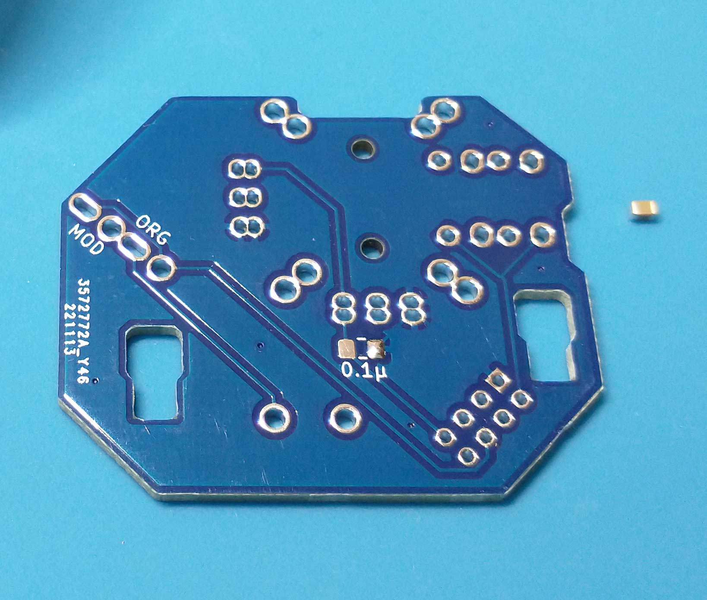
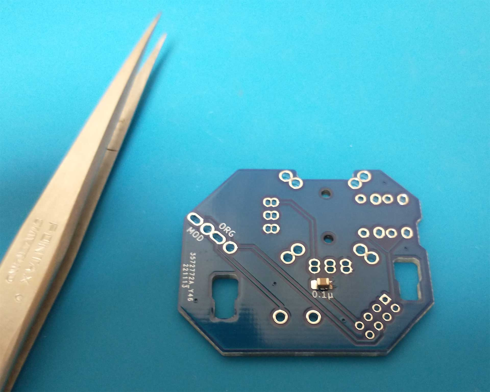
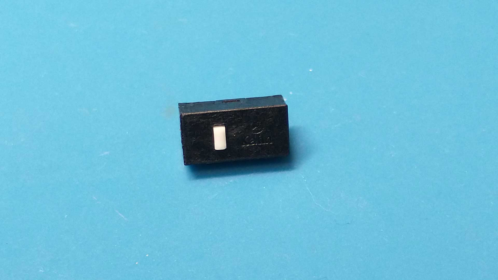
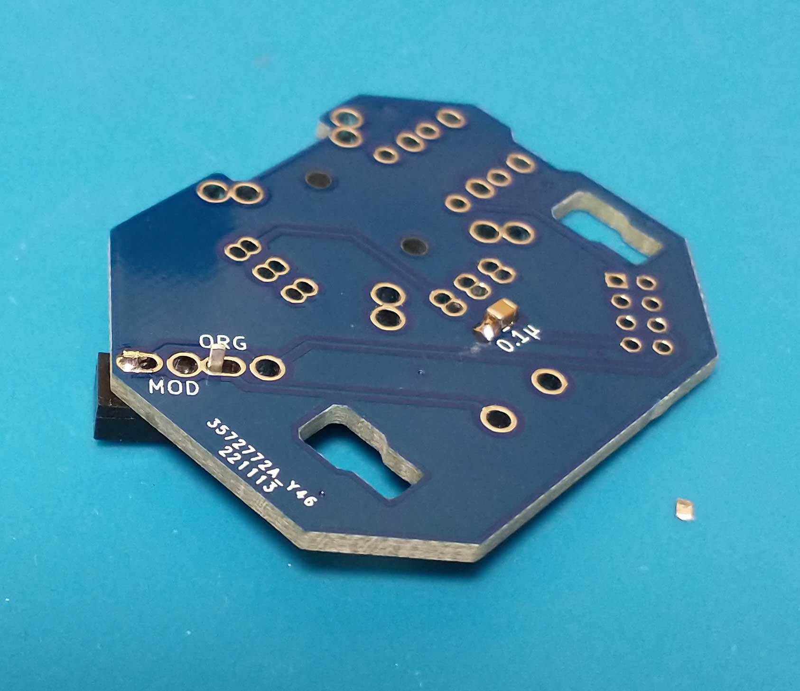
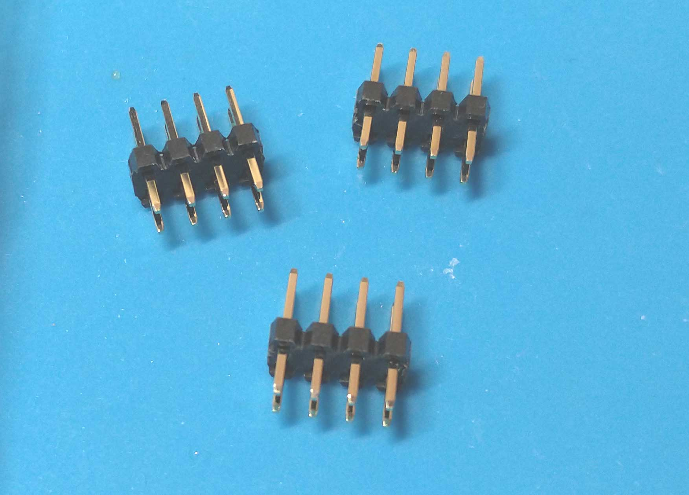

# G13 JoystickRepairkit 基板の覚え書き

  

 
 
 
 

### オリジナル基板との相違点

  

パスコンはオリジナルでは普通のコンデンサですが、本キットでは2012サイズのチップコンデンサを使用します。  

マイクロスイッチのハンダ付け位置変更により、ジョイスティック下スイッチ押し部品を使わずにスイッチを直接押す構造に変更可能。  

 
 
 

### チップコンデンサーのハンダ付け

  
0.1μとシルク印刷されたパターン1か所にハンダを盛ります。  
  

  
ピンセットで位置決めしつつ、１か所をハンダ付けします。  
コンデンサーの浮き、位置の曲がりがないことを確認したら、もう１か所もハンダ付けします。

 
 
 

### マイクロスイッチのハンダ付け

  
推奨のマイクロスイッチはkailh cmi873101d01です。  
当方はAliexpressのkailh switch Storeで入手しました。  

 
 
 

  
ジョイスティック下のマイクロスイッチはオリジナル位置かMOD位置を選択可能です。  
MOD位置では折れやすい小部品を介さず直接スイッチを押せるようになります。  
スイッチ外側のピンを少しカットして、楕円形ホールの外側にハンダ付けします。

 
 
 

### ピンヘッダ

  

2mmピッチの4x2列ピンヘッダを使用します。  
ヒロセA3B-8PA-2DSAか廣杉PSS-220154-04を推奨しますが、1列ピンヘッダしか入手できない場合はこれをカットして並べて使っても良いと思います。（写真は廣杉計器 PSS-220154-04)

 
 
 

### 使用できるアナログジョイスティック

  

オリジナルのジョイスティックはもちろんのこと、各社16mmジョイスティック、現在主流の13㎜サイズジョイスティックも使用可能です。  

（※可変抵抗が10kΩのものを選んでください。オリジナル以外では軸の形状に合わせたスティックカバーを3Dプリンタなどで自作する必要があります。FavorUnion、ALPS RKJXV122400R、RKJXK122400Yで使用できるスティックカバーの[stlとf3dのデータ](https://github.com/LHPbackup/G13RepairKit/blob/main/G13RepairKit_images/js_cover.zip)を準備したので参考にしてみてください。軸穴の嵌合がきつかったりゆるゆるの時はスライサーの設定やFusion360で再編集して下さい。）  

（写真左下より、G13オリジナル(Favor Union FJN10K-S 旧タイプ)、Logicool F310内蔵(FJN10K-S 新タイプ）、ALPS RKJXK122400Y、ALPS RKJXV122400R、写真上は中国の色々なジョイスティック）

 
 
 

### スティックカバーの自作

軸形状の違うジョイスティックを使う場合は、スティックカバーをそれにあった形状で自作する必要があります。  
 当方では3Dプリンタにて自作しております。  (KINGROON KP3S、PETGで出力。　[kit](https://github.com/LHPbackup/G13RepairKit/blob/main/G13RepairKit.md)付属の400Yカバーは出力後に軸を旋盤で追加工しております。400Yのデータを出力する場合は軸長を0.7mm短くして、1mm程度のc面を取って下さい）

 
 
 

### オリジナルと現在入手可能16mmジョイスティックの違い

 

オリジナルに使われているジョイスティックは軸受け横に出っ張りがないタイプで、これを使うと基板がまっすぐ接地するのですが、現在入手可能なF310内蔵のスティックやALPS、中国の16mmスティックは出っ張りがあるタイプで、基板が微かに浮きます。  

リペアキットの基板でも同様なのですが、実使用では問題ありません。（基板リプレース時に均等にねじを締めこんで上下に傾かないよう注意）

 
 
 
