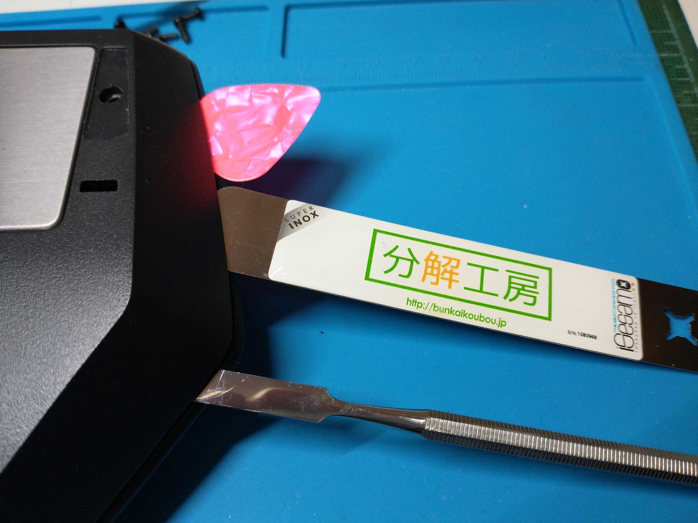
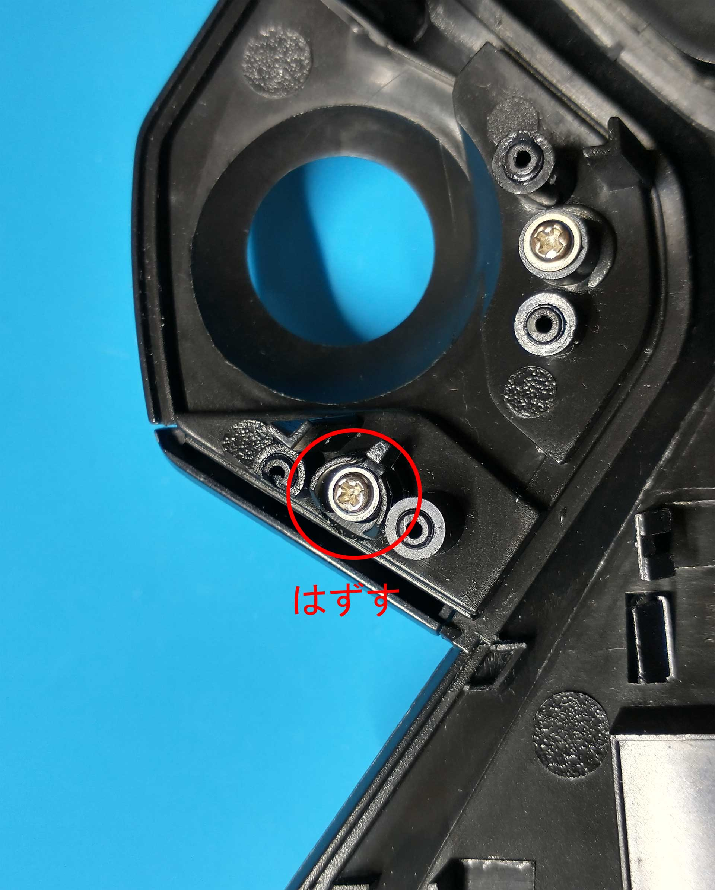
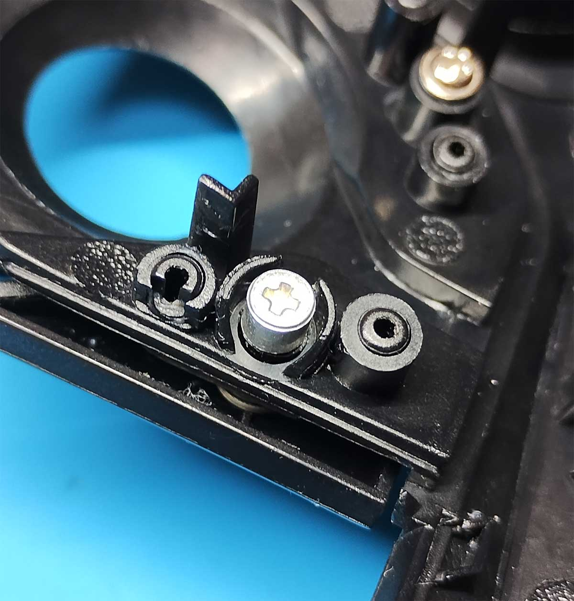
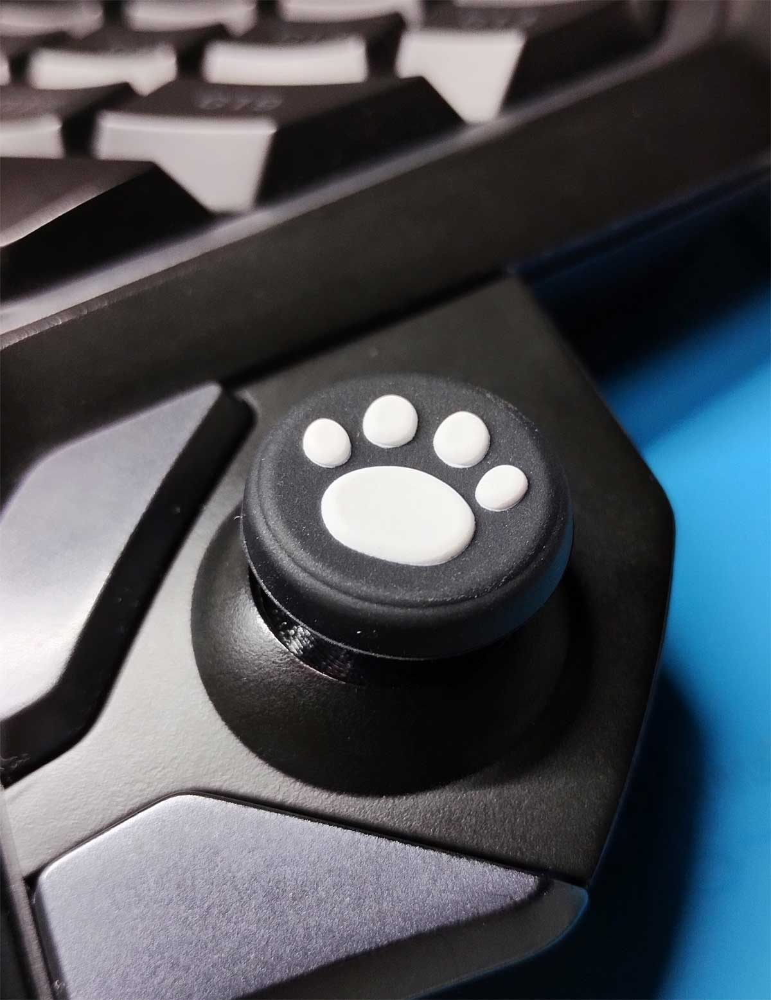
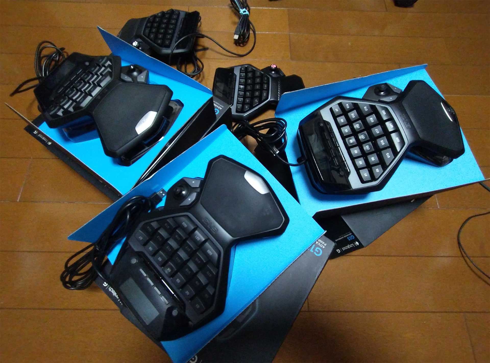

# G13 Joystick Repair kit 取付方法

  

ロジクールG13のアナログジョイスティック基板を丸ごとリプレースする
**G13 Joystick repair kit**です。  

ハンダ付け済み完成品でリリースします。

## ジョイスティックに高速レスポンスのGinfull TMR Joystickを採用しました。

 
 
 
 

## キット内容

・リペアキット本体（ジョイスティック、マイクロスイッチ、8Pピンヘッダ、コンデンサをハンダ付け済み）

・ジョイスティックカバー（3Dプリンタ印刷品。PETG素材）

・スティック下スイッチ押し用のネジ（アルミワッシャー付き）

・サムパッド  

 
 
 
 

## 取付方法

 
 

### １．G13の分解

  

ゴム滑り止め、真ん中の黒丸シール裏にあるねじを外します。（写真の赤丸部分6か所）  
 
 
 

合わせ目に薄いもの（ギターのピック、スパチュラ、スクレーパー、プラ製カードなど）を差し込み、中の爪を外していきます。    
 
 
 

爪は赤丸部分の10か所にあります。

特に上側2か所の爪は折れやすいです。（写真は折れてます^^;）  
 
 
 

### ２．ジョイスティックカバーの取付け

ポスト投函でのお届けが出来るよう、ジョイスティックカバーを外してお送りしております。

ジョイスティックの軸にジョイスティックカバーを奥までしっかり押し込みます。    
 
 

アナログスティック軸とジョイスティックカバーの穴は長円形（小判型）の形状をしております。穴と軸の向きをチェックして下さい。  

軸の根元がストッパー形状の段差になっております。スティックカバーを段差に当たるまで差し込んでください。  

 
 
 

### ３．基板のリプレース

基板に刺さっているコネクタを慎重に外します。  

**コネクタの配線の色の順番を必ず覚えておきましょう。**

ねじ2本を外し、元の基板を取り外します。（ねじ、黒いプラ製部品は再利用します）  
 
 
 

キットの基板をセットし、黒いプラ部品を取り付けます。  
 
 
 

ねじ2本を軽めに均等に締め込みます。  

コネクタを元の色の順番になるよう差し込みます。  

**※注意：コネクタは絶対に逆接しないでください。最悪の場合、ジョイスティックのICが破損します。**  
万一、色が分からなくなった時はコネクタを外してリペアキットへの接続を切った状態でG13のUSB端子をPCに接続し、コネクタケーブルの端子にテスターを当て3.3vとGNDが出ている端子を確認してください。

 
 
 

もしケーブルがボディ下部のクリップから外れている場合は、ケーブルを元の位置に戻します。
 
 
 

### ４．ジョイスティック下スイッチ押し部品のリプレース

ジョイスティック下スイッチ押し部品のねじを外します。黒い小部品も併せて取り外します。    
 
 
 

キット付属のねじ部品を使います。  
 
 
 

取り外した部分にキット付属のねじを取り付けます。直接スイッチを押す構造です。  
 
 
 

### ５．完成！！！

分解とは逆の手順で本体を組み立てなおします。
付属のサムパッドを取り付けたら完成です。  
 
 
 

### ６．キャリブレーション

windowsを再起動した後、コントロールパネル→ハードウエアとサウンド→デバイスとプリンター(Win11は右クリック→開く)→HID準拠ゲームコントローラー(右クリック)→ゲームコントローラーの設定→プロパティ→設定タブ→調整の手順でデバイスの調整ウィザードを開始し、ジョイスティックの校正を行ってください。  
 
 
 

ジョイスティック押し込みの反応が少し悪いです。これは本キットではなくG13の特性のようです。
（無改造のG13でも確かめましたが、全てのG13で同じような症状が出ます。拙作LHP14では切れ味良く反応するので少し焦りましたw）

 
 
 

### ７．変更履歴

rev 1.2　ファーストリリース  
rev 1.3　基板を変更（スティック下スイッチ取付位置が可変。性能は1.2と変わりません）  
　　　　付属のサムパッドを原価の都合でねこにゃんから安価なものに変更  
rev 1.4　基板を変更（ピンヘッダ位置を調整。性能は1.3と変わりません）  
　　　　マイクロスイッチをKailh CMI873101D01からHUANO WK-03Bに変更  
rev 1.5　基板を変更（基板色を変更。パスコンのパターンをリード・SMD共用化。）  
　　　　アナログジョイスティックをALPS RKJXK122400YからRKJXV122400Rに変更  
rev 1.6　基板を変更（ジョイスティック位置を調整。基板色を変更。）  
　　　　アナログスティックを Ginfull Hall effect joystick module for SWITCH PROに変更  
rev 1.7　アナログスティックを Ginfull TMR joystick for SWITCH PROに変更  
　　　　スティックカバー形状を変更  
　　　　基板色を変更（形状、パターンは1.6と変わっておりません。）  
rev 1.8　基板の変更等（部品位置の微細な調整等。1.7とほとんど変わりません）  
[**変更の概要はこちらをご参照下さい**](https://github.com/LHPbackup/G13RepairKit/blob/main/rev180_changelog.md) 
 
 

### rev1.7以降より、ジョイスティックをGinfull TMR Joystick for Switch Pro Controllerに変更

### より高速・高レスポンスになりました。

・TMRジョイスティックはホールエフェクトスティックの改良版です。ほとんどラグのない超ハイレスポンスで動作すると言われています。  

・可変抵抗式スティックと違い、物理的な電気接点がないので、高耐久・高寿命です。  

・当方の半年以上にわたるテストでも快調に動作しており、本部品を採用することに決めました。  

・Proコン用スティックはレバー操作に対しての数値変化が少し大きい特性があります。ただしrev1.6ホールエフェクト版より挙動はマイルドです。  

 
 

### G13 Joystick Repair kit 製作風景

[**G13 Joystick Repair kit 製作風景へのリンク**](https://github.com/LHPbackup/G13RepairKit/blob/main/G13RepairKit_Making.md)  

[**Ginfull TMR Joystickのおぼえがきへのリンク**](https://note.com/trinityironworks/n/n19a7288a2935)  
