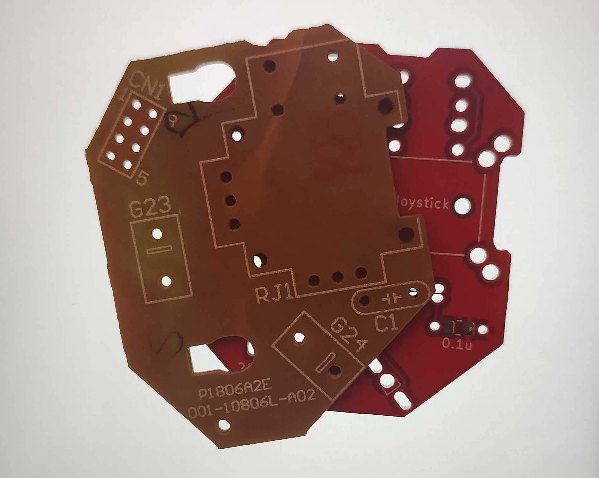
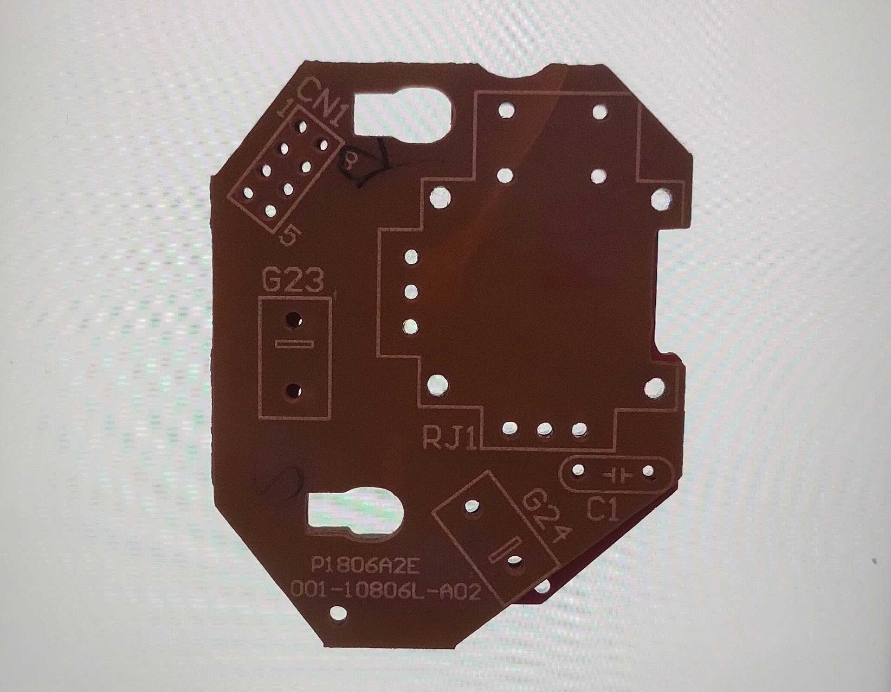
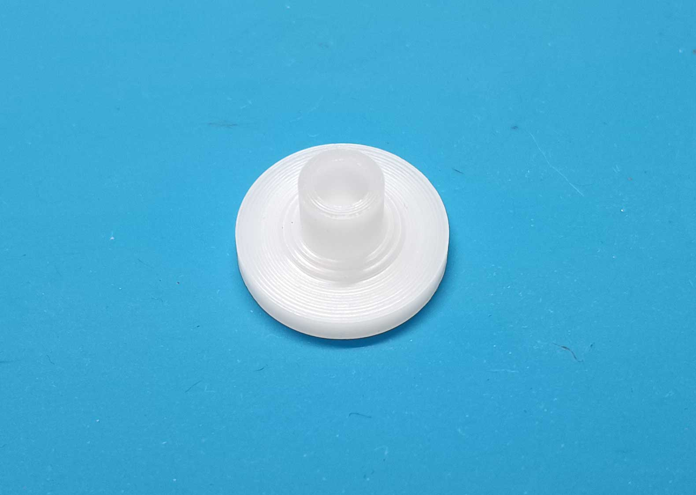
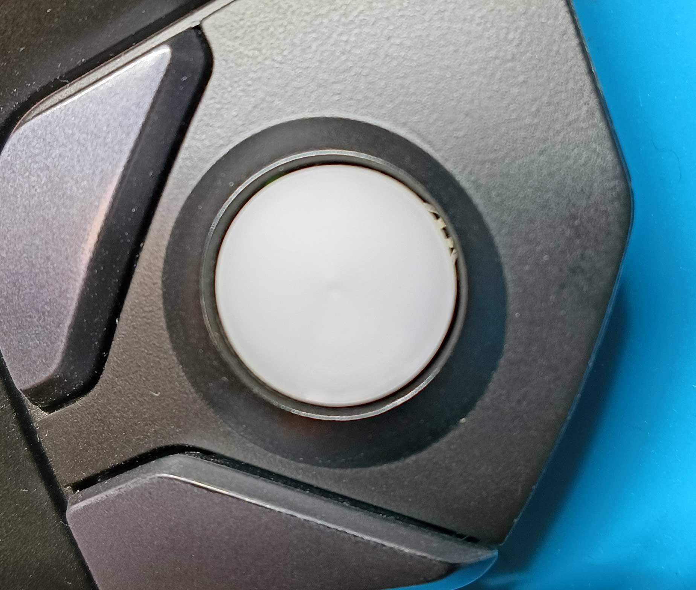
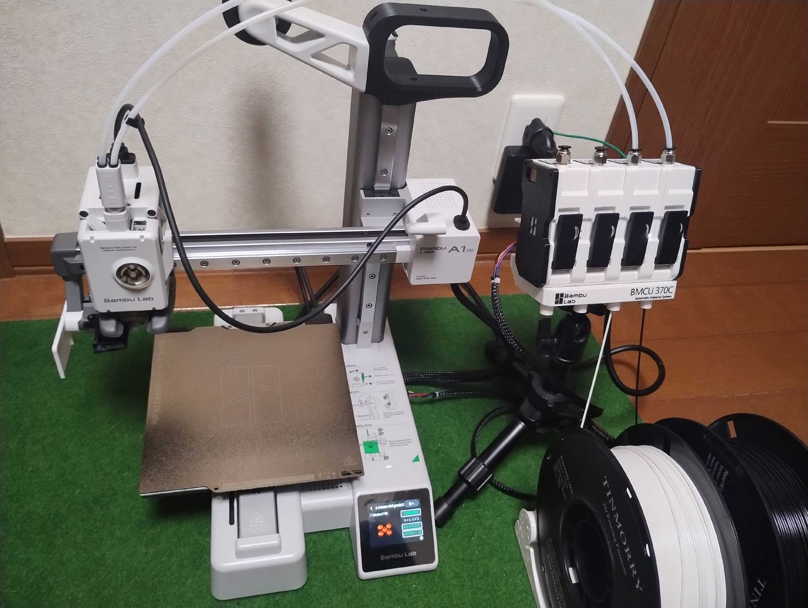
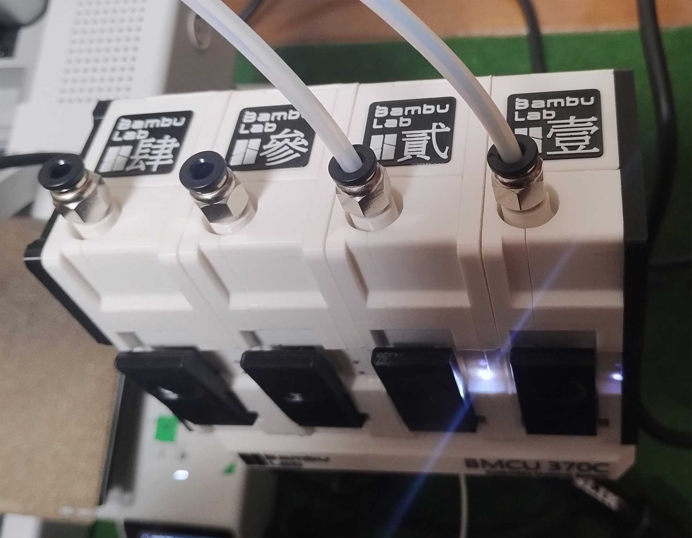
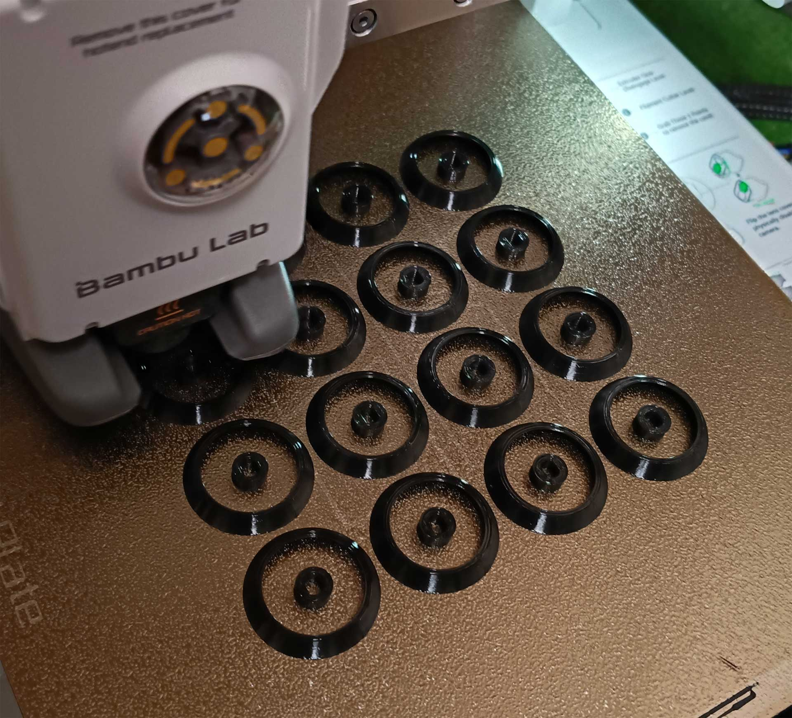
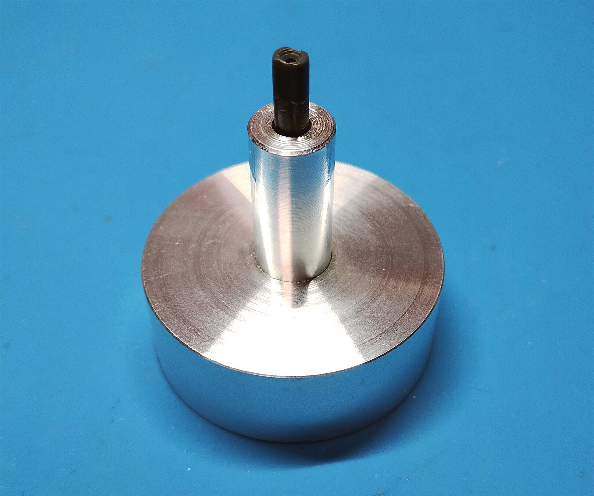
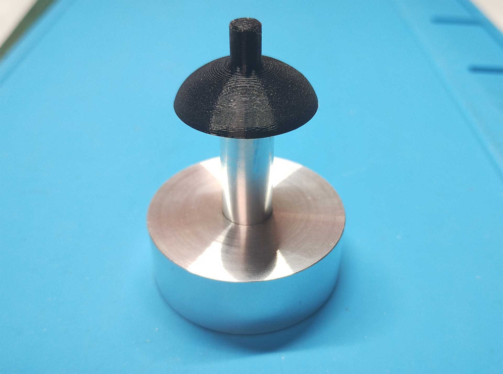

# G13 Joystick Repair kit rev1.8 Change log

 
 

  

基板を透過光でオリジナルと比較します。
 
 

今までも動作に影響ありませんでしたが、G23マイクロスイッチが少しずれています。  
これまでは部品を外側にずらしてハンダ付けしていましたが、1.8で基板を修正します。 
右側面の切り欠き位置も少しだけ修正します。
 
 

ジョイスティックがセンターに来ているか測定します。  
精度を出すために旋盤でエンジンニアプラスチックを削りだし、ゲージを作ります。  
 
 

本体とのクリアランスを見ます。  
ほぼセンターが出ていましたが、位置を0.数ミリ単位微調整しました。  
 
 

ジョイスティックカバーは3Dプリンタを今までKingroon KP3Sで出力していましたが、ストックがなくなり次第、BambuLab A1miniに変更します。  
 
 

AMSは互換品。キットで買ったので外装は自分で印刷しました。銘板や三脚用1/4inchマウント等、色々いじってますw  
 
 

これまでは30分位かけて1個ずつ印刷していましたが、今後はまとめて印刷します。  
A1mini用にCAD上の寸法を見直したので、精度も問題ありません。  
爆速で印刷できるようになりました。最近の3Dプリンタは凄い！w  
 
 

ジョイスティックカバーはフィッティングに問題ないか全数実際に取り付け確認しております。  
今まではジョイスティックそのものに取り付けていましたが、脱着時に当方の指が痛くなるので、軸に本物部品を使った治具を製作しました。  
 
 

A6061アルミ削りだしの高級仕様ですw  
 
 
 
 

rev1.8は以前の1.7と比べてごく軽微な変更になっていますので、実際のところ差異はほとんどありません。

当方の作業合理化と捉えて頂ければ幸いです。
